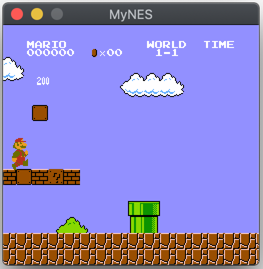

# C++一步步实现红白机模拟器

## 项目分解

选择**不同的分支来查看每次增加的内容**，以达到分解整个项目实现的目的。

- Day1：模拟CPU6502、总线和内存RAM，实现CPU可从内存中读写数据和取指令
- Day2：参考6502 CPU 的datasheet，实现了CPU对指令的解码执行
- Day3：解析卡带（Cartidge 游戏卡）的文件格式，编写简单的.nes程序（加法运算），测试 CPU 能否正常执行程序。
- Day4：实现 Mapper，预留给游戏卡的地址空间是有限的，游戏卡的程序内存（Program Memory）被限制在 32 KB，角色内存（Character Memory）被限制在 8 KB。为了突破这种限制，人们发明了内存映射器（Mapper）。
内存映射器是游戏卡中的一个硬件，具有存储体空间切换（Bank Switching）的功能，以将新的程序或角色内存引入到可寻址的内存空间。
- Day5：多媒体库（SFML 简单快速多媒体库）的配置和使用，并构建PPU总线（Picture Bus）以及虚拟屏幕(Virtual Screen)的实现
- Day6: 实现 PPU 的各个回调函数，显示游戏画面
- Day7：增加按键控制，愉快游戏！

## SFML 库的配置
根据自己所使用的操作系统，在[SFML官方文档](https://www.sfml-dev.org/tutorials/2.5/)找到对应的配置方式。

建议最好使用官方已经编译好的 SDK，替换到系统的默认动态链接库目录或任意目录下（此时编译链接时需要制定对应的头文件和库文件目录）

以我的环境：MacOS VSCode 为例。 在 Macos 下通过`brew install sfml`安装 SFML SDK后，将在`/usr/local/Cellar/sfml/2.5.1`目录下保存头文件和库文件。在 Makefile 文件下需要指定`CFLAGS`和`LDFLAGS`

```C
SFML_INC = /usr/local/Cellar/sfml/2.5.1/include
SFML_LIB = /usr/local/Cellar/sfml/2.5.1/lib

CFLAGS = -g -Wall -I${INC} -I${SFML_INC} -std=c++11 
LDFLAGS = -L${SFML_LIB} -lsfml-graphics -lsfml-window -lsfml-system
```

## 执行

```c

git clone https://github.com/SmallPond/MyNES

cd MyNES

mkdir build

# 编译
make

# 【注意】若没有将 SFML 库放置到系统默认的目录下，执行时需要指定动态链接库的路径
export LD_LIBRARY_PATH=<sfml-install-path>/lib

# 执行
./myNES ./resources/Super_mario_brothers.nes
```





# 参考文献

1. [nesdev wiki ](https://wiki.nesdev.com/w/index.php/Nesdev#NES)
2. [NES专题——PPU工作原理](https://blog.csdn.net/qq_34254642/article/details/104193445)
3. [Nintendo Entertainment System Architecture](http://fms.komkon.org/EMUL8/NES.html)
4. [wiki_nesdev_标准控制器](https://wiki.nesdev.com/w/index.php/Standard_controller)