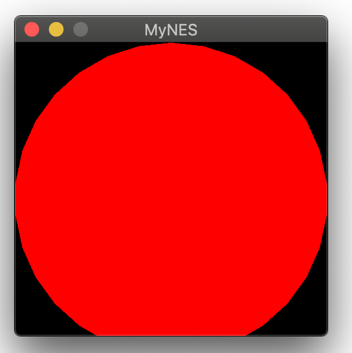

# C++一步步实现红白机模拟器

选择不同的分支来查看每次增加的内容，以达到分解整个项目实现的目的。

```
# 编译
make
# 执行
./myNES ./resources/Super_mario_brothers.nes
```

## Day1:

6502 拥有 16 位地址空间，寻址能力为 64 KB。但是 NES 实际只有 2 KB的内部 RAM，对应的地址范围是 0000～0799。而剩余的地址空间则用于访问 PPU、 APU、游戏卡以及输入设备等。  
6502 上有些地址总线的引脚并没有布线，所以有很大的一块内存空间实际上都映射到了之前的空间。例如 RAM 中的 1000～17FF 就映射到了 0000～07FF，这意味着向 1000 写数据等价于向 0000 写数据。 

模拟6502 CPU 、总线和内存RAM，实现CPU可从内存中读写数据和取指令 
## Day2: 

参考6502 CPU 的datasheet，实现了CPU对指令的解码执行
## Day3
[注] main分支删除了为了测试CPU工作而添加的一些不必要接口，例如`MainBus(Cartridge& cartridge)`、`Byte GetACC() { return r_A;}`，如果需要测试，需要切换到Day3分支
```c
git checkout day3
```

NES 软件编写示例，位于`example/nes`目录下，主要包括文件
- `nes.cfg`：指定了链接方式
- `example.asm`： 实现了一个简单的4+2的操作


### 编译器下载安装

- MacOS: `brew install cc65`
- [Linux: 下载安装](https://debian.trikaliotis.net/cc65/)
- Windows: 下载安装 [https://sourceforge.net/projects/cc65/files/cc65-snapshot-win32.zip]

### 编译链接
```
# 编译
ca65 example.asm -o example.o 
ld65 -C nes.cfg example.o -o example.nes
```

### 查看生成的.nes文件

vscode下安装`hexdump for vscode`,使用二进制阅读器打开后可看到:
- 0x0000：一行自动补齐了NES文件的header
- 0x0010：一行中`A9 04`对应了汇编语句`LDA #$4`, `69 02`对应了汇编语句`ADC #$2`
- 0x8000：中断向量表中保存了目标地址`0x8000`，这是因为我们在 example/nes/nes.cfg文件中指定了`PRG: start = $8000`，也就是我们汇编代码中的main函数首地址。

```
00000000: 4E 45 53 1A 02 00 00 00 00 00 00 00 00 00 00 00    NES.............
00000010: A9 04 69 02 00 00 00 00 00 00 00 00 00 00 00 00
...
...
00008000: 00 00 00 00 00 00 00 00 00 00 00 80 00 80 00 80
```

### 编译执行模拟器
```
# 编译模拟器
make
# 运行
./myNES
```

执行结果如下：
```c
Reading ROM from path: ./examples/nes/example.nes
Reading header, it dictates: 
16KB PRG-ROM Banks: 2
8KB CHR-ROM Banks: 0
ROM is NTSC compatible.
a9 4 69 2 0 0 0 0 0 0 0 0 0 0 0 0 0 0 0 0 
Cartridge with CHR-RAM.
MainBus Read a Byte: 0
MainBus Read a Byte: 80
[+]After reset, the PC is: 8000
MainBus Read a Byte: a9
MainBus Read a Byte: 4
MainBus Read a Byte: 69
MainBus Read a Byte: 2
[+]执行4+2的操作后，ACC寄存器的值为:6
```

# Day4_Mapper实现

## Mapper(继承与多态)
> 预留给游戏卡的地址空间是有限的，游戏卡的程序内存（Program Memory）被限制在 32 KB，角色内存（Character Memory）被限制在 8 KB。为了突破这种限制，人们发明了内存映射器（Mapper）。  
内存映射器是游戏卡中的一个硬件，具有存储体空间切换（Bank Switching）的功能，以将新的程序或角色内存引入到可寻址的内存空间。程序可以通过向指向内存映射器的特定的地址写入数据来控制存储体空间的切换。  
不同的游戏卡实现了不同的存储体空间切换方案，所以会有十几种不同的内存映射器。既然模拟器要模拟 NES 的硬件，也就必须能够模拟游戏卡的 内存映射器。尽管如此，实际上 90% 的 FC 游戏使用的都是六种最常见的内存映射器中的一种。

以上参考： [我用 Go 语言做了一个红白机模拟器](https://studygolang.com/articles/03157)

因此，Mapper存在多种不同的实现方式。对应不同的卡带应标识该卡带使用的Mapper类型。

day3我们简单解析了.NES文件，参考[官方wiki](https://wiki.nesdev.com/w/index.php/INES)，其格式可表示如下，

```c
0-3: Constant $4E $45 $53 $1A ("NES" followed by MS-DOS end-of-file)
4: Size of PRG ROM in 16 KB units
5: Size of CHR ROM in 8 KB units (Value 0 means the board uses CHR RAM)
6: Flags 6 - Mapper, mirroring, battery, trainer
7: Flags 7 - Mapper, VS/Playchoice, NES 2.0
8: Flags 8 - PRG-RAM size (rarely used extension)
9: Flags 9 - TV system (rarely used extension)
10: Flags 10 - TV system, PRG-RAM presence (unofficial, rarely used extension)
11-15: Unused padding (should be filled with zero, but some rippers put their name across bytes 7-15)

Flag6的具体含义如下：
76543210
||||||||
|||||||+- 镜像位: 0: 水平 1：垂直。 游戏是横版还是纵版             
||||||+-- 1: 卡带包含电池供电的RAM($6000-7FFF)或其他持久性存储介质
|||||+--- 1: trainer 标志位，可不管
||||+---- 1: 忽略镜像控制或上述的镜像位；而是提供四屏VRAM。由于 NES 的显存只有2kb, 只能支持2屏幕. 如果卡带自带了额外的显存就可以利用4屏幕了
++++----- Mapper号的低四位

Flag7的具体含义如下：
76543210
||||||||
|||||||+- VS Unisystem
||||||+-- PlayChoice-10 (8KB of Hint Screen data stored after CHR data)
||||++--- If equal to 2, flags 8-15 are in NES 2.0 format
++++----- Mapper编号的高四位
```

Flags6的高四位记录了mapper number的低四位，Flags7的高四位记录了mapper number的高四位。

## Emulator

增加 Emulator 以综合各个组件

# Day5

## SFML多媒体库配置和使用
根据自己所使用的操作系统，在[SFML官方文档](https://www.sfml-dev.org/tutorials/2.5/)找到对应的配置方式。

建议最好使用官方已经编译好的 SDK，替换到系统的默认动态链接库目录或任意目录下（此时编译链接时需要制定对应的头文件和库文件目录）

例如，在 Macos 下通过`brew install sfml`安装 SFML SDK后，将在`/usr/local/Cellar/sfml/2.5.1`目录下保存头文件和库文件。在 Makefile 文件下需要指定`CFLAGS`和`LDFLAGS`。

```c
SFML_INC = /usr/local/Cellar/sfml/2.5.1/include

CFLAGS = -g -Wall -I${INC} -I${SFML_INC} -std=c++11
# 不仅要指定目录，还要指定对应链接的库，不然就是 undefined reference 
LDFLAGS = -L/usr/local/Cellar/sfml/2.5.1/lib -lsfml-graphics -lsfml-window -lsfml-system
```

编译运行结果如图：




## PPU总线（Picture Bus）以及虚拟屏幕(Virtual Screen)的实现

在使用 SFML 库创建一个 windows后，内容的填充使用 VirtualScreen 类来实现。PictureBus 类似于我们之前实现的 MainBus，不过 PictureBus 是用来连接PPU（Picture Processing Unit,类比于现在的显卡）和 vdeio 相关的存储的。 